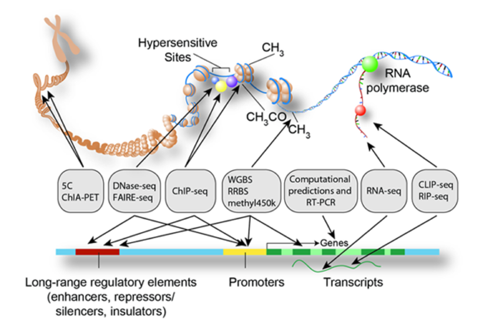

```{r, include=FALSE}
library(knitr)
opts_chunk$set(message=FALSE, warning=FALSE, eval=TRUE, echo=TRUE, cache=TRUE)
library(icon)

CRANpkg <- function (pkg) {
    cran <- "https://CRAN.R-project.org/package"
    fmt <- "[%s](%s=%s)"
    sprintf(fmt, pkg, cran, pkg)
}

Biocpkg <- function (pkg) {
    sprintf("[%s](http://bioconductor.org/packages/%s)", pkg, pkg)
}
```

## General Information

<https://odinlister.sdu.dk/fagbesk/internkode/BMB209/en>

**_When_: Jan. 25, 2019**

**_Where_: University of Southern Denmark, Odense**  


**_Instructor_: Guangchuang Yu**&nbsp;
[`r fa("envelope")`](mailto:guangchuangyu@gmail.com)
[`r fa("university")`](http://portal.smu.edu.cn/jcyxy/info/1084/2203.htm)
[`r fa("twitter")`](https://twitter.com/guangchuangyu)
[`r fa("github")`](https://github.com/GuangchuangYu/)
[`r fa("rss")`](https://guangchuangyu.github.io)

<small>Guangchuang Yu, Ph.D. is faculty in the School of Basic Medical Sciences at the Southern Medical University.</small>

## Workshop Description

This workshop gives an overview of commonly used methods for enrichment analysis of gene expression data with regard to functional gene sets and pathways, and introduces pathway analysis using *clusterProfiler*. The *clusterProfiler* package was designed by considering the supports of multiple ontology/pathway annotations, up-to-date gene annotation, multiple organisms, user customized annotation data and comparative analysis. The workshop will provide reproducible examples of pathway analysis, along with visualization and exploration of results.

The material of this workshop is hosted on [`r fa("github")` github](https://guangchuangyu.github.io/pathway-analysis-workshop/), with [`r fa("file-alt")` source file](https://guangchuangyu.github.io/pathway-analysis-workshop/index.Rmd) provided.

### Pre-requisites

+ Basic knowledge of R syntax
+ Familiar with high-throughput gene expression data as obtained with microarray and RNA-seq
+ Familiarity with the concept of differential expression analysis (with e.g. limma, edgeR, DESeq2)

### Workshop Participation

Execution of example code on practice

### R/Bioconductor packages used

+ clusterProfiler
+ cowplot
+ DOSE
+ dplyr
+ enrichplot
+ ggplot2
+ magrittr
+ msigdbr
+ org.Hs.eg.db

Using the following command to install these packages:

```r
install.packages(c("BiocManager", "cowplot", "dplyr", "ggplot2", "magrittr", "msigdbr"))
BiocManager::install(c("clusterProfiler", "DOSE", "enrichplot", "org.Hs.eg.db"))
```

## Terminology

### Gene sets and pathway

Gene sets are simple lists of usually functional related genes without further specification of relationships between genes.

Pathways can be interpreted as specific gene sets, typically representing a group of genes that work together in a biological process. 

### Gene Ontology (GO)


[Gene Ontology](http://www.geneontology.org/) defines concepts/classes used to describe gene function, and relationships between these concepts. It classifies functions along three aspects:

+ MF: Molecular Function
  - molecular activities of gene products
+ CC: Cellular Component
  - where gene products are active
+ BP: Biological Process
  - pathways and larger processes made up of the activities of multiple gene products

GO terms are organized in a directed acyclic graph, where edge between the terms represent parent-child relationship.


### Kyoto Encyclopedia of Genes and Genomes (KEGG)

[KEGG](https://www.genome.jp/kegg/) is a collection of manually drawn pathway maps representing molecular interaction and reaction networks. These pathways cover a wide range of biochemical processes that can be divided in 7 broad categories: metabolism, genetic and environmental information processing, cellular processes, organismal systems, human diseases, and drug development.

### Other gene sets

GO and KEGG are most frequently used for the functional analysis. They are typically the first choice because their long-standing curation and availability for a wide range of species.


Other gene sets including but not limited to Disease Ontology ([DO](http://disease-ontology.org/)), Disease Gene Network ([DisGeNET](https://www.ncbi.nlm.nih.gov/pmc/articles/PMC4397996/)), [wikiPathways](https://www.wikipathways.org), Molecular Signatures Database ([MSigDb](http://software.broadinstitute.org/gsea/msigdb)). 


## Over Representation Analysis

Over Representation Analysis (ORA) [@boyle2004] is a widely used approach to determine whether known biological functions or processes are over-represented (= enriched) in an experimentally-derived gene list, *e.g.* a list of differentially expressed genes (DEGs). 


The _p_-value can be calculated by hypergeometric distribution.


$p = 1 - \displaystyle\sum_{i = 0}^{k-1}\frac{{M \choose i}{{N-M} \choose {n-i}}} {{N \choose n}}$

In this equation, `N` is the total number of genes in the background distribution,
`M` is the number of genes within that distribution that are annotated (either directly or indirectly) to the gene set of interest,
`n` is the size of the list of genes of interest and `k` is the number of genes within that list which
are annotated to the gene set. The background distribution by default is
all the genes that have annotation. _P_-values should be adjusted for [multiple comparison](https://en.wikipedia.org/wiki/Multiple_comparisons_problem).


**Example:** Microarray study, in which 11,812 genes have been tested for differential expression between two sample conditions and 202 genes were found DE.

Among the DE genes, 25 are annotated to a specific functional gene set, which contains in total 262 genes. This setup corresponds to a 2x2 contingency table:

```{r}
d <-  matrix(c(25, 237, 177, 11323), 
          nrow = 2, 
          dimnames = list(c("DE", "Not DE"),
                        c("In GS", "Not in GS")))
d
```                        


whether the overlap of 25 genes are significantly over represented in the gene set can be assessed using hypergeometric distribution. This corresponding to a one-sided version of Fisher's exact test.

```{r}
fisher.test(d, alternative = "greater")
```


## Gene Set Enrichment Analysis

A major limitation of ORA is that it restricts analysis to DEGs, excluding the vast majority of genes not satisfying the chosen significance threshold.

This is resolved by gene set enrichment analysis (GSEA) [@subramanian_gene_2005]. GSEA aggregates the per gene statistics across genes within a gene set, therefore making it possible to detect situations where all genes in a predefined set change in a small but coordinated way. Since it is likely that many relevant phenotypic differences are manifested by small but consistent changes in a set of genes.

Genes are ranked based on their phenotypes. Given a priori defined set of gene _S_ (e.g., genes sharing the same _GO_ category), the goal of GSEA is to determine whether the members of _S_ are randomly distributed throughout the ranked gene list (_L_) or primarily found at the top or bottom.

There are two key elements of the GSEA method:

* Calculation of an Enrichment Score.
  + The enrichment score (_ES_) represent the degree to which a set _S_ is over-represented at the top or bottom of the ranked list _L_. The score is calculated by walking down the list _L_, increasing a running-sum statistic when we encounter a gene in _S_ and decreasing when it is not. The magnitude of the increment depends on the gene statistics (e.g., correlation of the gene with phenotype). The _ES_ is the maximum deviation from zero encountered in the random walk; it corresponds to a weighted Kolmogorov-Smirnov-like statistic.
* Esimation of Significance Level of _ES_.
  + The _p_-value of the _ES_ is calculated using permutation test. Specifically, we permute the gene labels of the gene list _L_ and recompute the _ES_ of the gene set for the permutated data, which generate a null distribution for the _ES_. The _p_-value of the observed _ES_ is then calculated relative to this null distribution.


## Input data

For over representation analysis, all we need is a gene vector, that is a vector of gene IDs. These gene IDs can be obtained by differential expression analysis (*e.g.* with [DESeq2](http://www.bioconductor.org/packages/DESeq2) package). 

For gene set enrichment analysis, we need a ranked list of genes. `r Biocpkg("DOSE")` provides an example dataset `geneList` which was derived from `R` package `r Biocpkg("breastCancerMAINZ")` that contained 200 samples, including 29 samples in grade I, 136 samples in grade II and 35 samples in grade III. We computed the ratios of geometric means of grade III samples versus geometric means of grade I samples. Logarithm of these ratios (base 2) were stored in `geneList` dataset.

The `geneList` contains three features:

1. numeric vector: fold change or other type of numerical variable
2. named vector: every number was named by the corresponding gene ID
3. sorted vector: number should be sorted in decreasing order

Suppose you are importing your own data from a *csv* file and the file contains two columns, one for gene ID (no duplicated allowed) and another one for fold change, you can prepare your own `geneList` via the following command:

```r
d <- read.csv(your_csv_file)
## assume that 1st column is ID
## 2nd column is fold change

## feature 1: numeric vector
geneList <- d[,2]

## feature 2: named vector
names(geneList) <- as.character(d[,1])

## feature 3: decreasing order
geneList <- sort(geneList, decreasing = TRUE)
```

We can load the sample data into R via:

```{r}
data(geneList, package="DOSE")
head(geneList)
```

Suppose we define fold change greater than 2 as DEGs:

```{r}
gene <- names(geneList)[abs(geneList) > 2]
head(gene)
```

## clusterProfiler as an universal enrichment analysis tool

*clusterProfiler* [@yu2012] internally supports enrichment analysis using different ontology and pathways, including GO, DO, KEGG and Reactome pathway. This is not enough for users may want to analyze their data with unsupported organisms, slim version of GO, novel functional annotation (*e.g.* GO via blastgo and KEGG via KAAS), unsupported ontology/pathway or customized annotation.


*clusterProfiler* provides `enricher` function for hypergeometric test and `GSEA` function for gene set enrichment analysis that are designed to accept user defined annotation. They accept two additional parameters `TERM2GENE` and `TERM2NAME`. As indicated in the parameter names, `TERM2GENE` is a data.frame with first column of term ID and second column of corresponding mapped gene, while `TERM2NAME` is a data.frame with first column of term ID and second column of corresponding term name. `TERM2NAME` is optional. 


Here using *clusterProfiler* to analyze wiki pathways and molecular signatures database as examples. 


### WikiPathways analysis


[WikiPathways](https://www.wikipathways.org) is a continuously updated pathway database curated by a community of researchers and pathway enthusiasts. WikiPathways produces monthly releases of gmt files for supported organisms at [data.wikipathways.org](http://data.wikipathways.org/current/gmt/). Download the appropriate gmt file and then generate `TERM2GENE` and `TERM2NAME` to use `enricher` and `GSEA` functions. 

```{r}
library(magrittr)
library(clusterProfiler)

data(geneList, package="DOSE")
gene <- names(geneList)[abs(geneList) > 2]

wpgmtfile <- system.file("extdata/wikipathways-20180810-gmt-Homo_sapiens.gmt", package="clusterProfiler")
wp2gene <- read.gmt(wpgmtfile)
wp2gene <- wp2gene %>% tidyr::separate(ont, c("name","version","wpid","org"), "%")
wpid2gene <- wp2gene %>% dplyr::select(wpid, gene) #TERM2GENE
wpid2name <- wp2gene %>% dplyr::select(wpid, name) #TERM2NAME

ewp <- enricher(gene, TERM2GENE = wpid2gene, TERM2NAME = wpid2name)
head(ewp)

ewp2 <- GSEA(geneList, TERM2GENE = wpid2gene, TERM2NAME = wpid2name, verbose=FALSE)
head(ewp2)
```

You may want to convert the gene IDs to gene symbols, which can be done by `setReadable` function. 


```{r}
library(org.Hs.eg.db)
ewp <- setReadable(ewp, org.Hs.eg.db, keyType = "ENTREZID")
ewp2 <- setReadable(ewp2, org.Hs.eg.db, keyType = "ENTREZID")
head(ewp)
head(ewp2)
```

As an alternative to manually downloading gmt files, install the [rWikiPathways package](https://bioconductor.org/packages/release/bioc/html/rWikiPathways.html) to gain scripting access to the latest gmt files using the `downloadPathwayArchive` function.


	

### MSigDb analysis


[Molecular Signatures Database](http://software.broadinstitute.org/gsea/msigdb) contains 8 major collections:

* H: hallmark gene sets
* C1: positional gene sets
* C2: curated gene sets
* C3: motif gene sets
* C4: computational gene sets
* C5: GO gene sets
* C6: oncogenic signatures
* C7: immunologic signatures

Users can download GMT files from [Broad Institute](http://software.broadinstitute.org/gsea/msigdb) and use `read.gmt` to parse the file to be used in `enricher()` and `GSEA()`.

There is an R package, [msigdbr](https://cran.r-project.org/package=msigdbr), that already packed the MSigDB gene sets in tidy data format that can be used directly with *clusterProfiler*.

It supports several specices:

```{r}
library(msigdbr)
msigdbr_show_species()
```

We can retrieve all human gene sets:

```{r}
m_df <- msigdbr(species = "Homo sapiens")
head(m_df, 2) %>% as.data.frame
```


Or specific collection. Here we use C6, oncogenic gene sets as an example:
```{r}
m_t2g <- msigdbr(species = "Homo sapiens", category = "C6") %>% 
  dplyr::select(gs_name, entrez_gene)
head(m_t2g)

em <- enricher(gene, TERM2GENE=m_t2g)
em2 <- GSEA(geneList, TERM2GENE = m_t2g)
head(em)
head(em2)
```

We can test with other collections, for example, using C3 to test whether the genes are up/down-regulated by sharing specific motif.

```{r}
m_t2g <- msigdbr(species = "Homo sapiens", category = "C3") %>% 
  dplyr::select(gs_name, entrez_gene)
head(m_t2g)

em3 <- GSEA(geneList, TERM2GENE = m_t2g)
head(em3)
```

## Gene Ontology Analysis

  
GO enrichment analysis is internally supported via `enrichGO` (for ORA) and `gseGO` (for GSEA). These two functions combine with `OrgDb` as background annotation. There are 19 `OrgDb` for 19 species respectively available via the [Bioconductor proejct](https://bioconductor.org/packages/release/BiocViews.html#___OrgDb).
  
For example, [org.Hs.eg.db](https://bioconductor.org/packages/release/data/annotation/html/org.Hs.eg.db.html) contains genome wide annotation for human.

Here are the examples of using `enrichGO` and `gseGO` for GO enrichment analysis:

```{r}
library(clusterProfiler)

data(geneList, package="DOSE")
gene <- names(geneList)[abs(geneList) > 2]

ego <- enrichGO(gene          = gene,
                universe      = names(geneList),
                OrgDb         = org.Hs.eg.db,
                ont           = "CC",
                pAdjustMethod = "BH",
                pvalueCutoff  = 0.01,
                qvalueCutoff  = 0.05,
                readable      = TRUE)
```

Instead of using whole genome annotation as background, users can specify background by the `universe` parameter. For example, all genes that are actually expressed in an experiment.

```{r}
head(ego)
```


Similary, we can run GSEA test using `gseGO` function:

```r
ego2 <- gseGO(geneList     = geneList,
              OrgDb        = org.Hs.eg.db,
              ont          = "CC",
              nPerm        = 1000,
              minGSSize    = 100,
              maxGSSize    = 500,
              pvalueCutoff = 0.05,
              verbose      = FALSE)
```


### GO analysis for non-model organisms

Both `enrichGO` and `gseGO` functions require an `OrgDb` object as background annotation. For organisms that don't have `OrgDb` provided by Bioconductor, users can query one (if available) online via `r Biocpkg("AnnotationHub")`. If there is no `OrgDb` available, users can obtain GO annotation from other sources, e.g. from `r Biocpkg("biomaRt")` or [Blast2GO](https://www.blast2go.com/). Then using `enricher` or `GSEA` function to analyze, similar to the examples using wikiPathways and MSigDB. Another solution is to create `OrgDb` by your own using `r Biocpkg("AnnotationForge")` package.

### Reducing GO redundancy

GO is organized in parent-child structure, thus a parent term can be overlap with a large proportion with all its child terms. This can result in redundant findings. To solve this issue, *clusterProfiler* implement `simplify` method to reduce redundant GO terms from the outputs of `enrichGO` and `gseGO`. The function internally called *GOSemSim* [@yu2010] to calculate semantic similarity among GO terms and remove those highly similar terms by keeping one representative term.

```{r}
sego <- simplify(ego)

library(enrichplot)
emapplot(ego)
emapplot(sego)
```


## KEGG Analysis

Most of the tools for KEGG analysis use out-dated KEGG annotation. *clusterProfiler* supports downloading latest online version of KEGG data for enrichment analysis. It supports KEGG [Pathway](https://www.genome.jp/kegg/pathway.html) and [Module](https://www.genome.jp/kegg/module.html). 


```{r}
kk <- enrichKEGG(gene, organism = "hsa")
head(kk)
```

```{r}
gk <- gseKEGG(geneList, organism="hsa", nPerm=10000)
head(gk)
```


It supports all species that have KEGG annotation data available in the KEGG database. The full list of KEGG supported organisms can be accessed via <http://www.genome.jp/kegg/catalog/org_list.html>.


[KEGG Orthology](https://www.genome.jp/kegg/ko.html) (KO) Database is also supported by specifying `organism = "ko"`.

## Disease, Reactome and MeSH

*clusterProfiler* also supports Disease Ontology, Reactome Pathway and Medical Subject Headings (MeSH) via its sub-packages, `r Biocpkg("DOSE")` [@yu_dose_2015], `r Biocpkg("ReactomePA")` [@yu_reactomepa_2016] and `r Biocpkg("meshes")` [@yu_meshes_2018]. Please refer to the packages' online vignettes for more details.

## Functional enrichment of genomic region

Next-generation sequencing is also widely applied for detecting variable and regulatory regions, *e.g.* single nucleotide polymorphisms, copy number variations and transcription factor binding sites. 




`r Biocpkg("ChIPseeker")` provides a function, `seq2gene`, for linking genomic regions to genes in a many-to-many mapping. It consider host gene (exon/intron), promoter region and flanking gene from intergenic region that may under control via cis-regulation. After changing genomic region into gene information, we can apply `r Biocpkg("clusterProfiler")` to test whether the genomic regions of interest is associated with particular functions and pathways.

Please refer to [*ChIPseeker* vignette](https://bioconductor.org/packages/release/bioc/vignettes/ChIPseeker/inst/doc/ChIPseeker.html#functional-enrichment-analysis) for more details.


## Visualization

The visualization methods were implemented on `r Biocpkg("enrichplot")` package. 

### Dot plot

```{r}
dotplot(ego, showCategory = 10)
```

### Gene-Concept Network


In order to consider the potentially biological complexities in which a gene may belong to multiple annotation categories and provide information of numeric changes if available, `r Biocpkg("enrichplot")` provides `cnetplot` function to extract the complex association. 
The `cnetplot` depicts the linkages of genes and biological concepts (*e.g.* GO terms or KEGG pathways) as a network. GSEA result is also supported with only core enriched genes displayed.

```{r fig.width=12, fig.height=8}
cnetplot(sego, foldChange=geneList)
```


### Heatmap-like functional classification


The `heatplot` is similar to `cnetplot`, while displaying the relationships as a
heatmap. The gene-concept network may become too complicated if user want to
show a large number significant terms. The `heatplot` can simplify the result
and more easy to identify expression patterns.

```{r fig.width=16, fig.height=4}
heatplot(sego, foldChange=geneList)
```

### Enrichment Map


Enrichment map organizes enriched terms into a network with edges connecting
overlapping gene sets. In this way, mutually overlapping gene sets are tend to
cluster together, making it easy to identify functional module.

The `emapplot` function supports results obtained from hypergeometric test and gene set enrichment analysis.
```{r fig.width=12, fig.height=10}
emapplot(ego)
```


## ridgeline plot for expression distribution of GSEA result

The `ridgeplot` will visualize expression distributions of core enriched genes
for GSEA enriched categories. It helps users to interpret up/down-regulated pathways.

```{r fig.width=12, fig.height=8, message=FALSE}
ridgeplot(gk)
```


## running score and preranked list of GSEA result

Running score and preranked list are traditional methods for visualizing GSEA
result. The `r Biocpkg("enrichplot")` package supports both of them to visualize
the distribution of the gene set and the enrichment score.


```{r fig.width=12, fig.height=8}
gseaplot(gk, geneSetID = 1, title = gk$Description[1])
```

Another method to plot GSEA result is the `gseaplot2` function:

```{r fig.width=12, fig.height=8}
gseaplot2(gk, geneSetID = 1, title = gk$Description[1])
```

The `gseaplot2` also supports multile gene sets to be displayed on the same figure:

```{r fig.width=12, fig.height=8}
gseaplot2(gk, geneSetID = 1:3)
```


The `gsearank` function plot the ranked list of genes belong to the specific
gene set.

```{r fig.width=8, fig.height=4}
gsearank(gk, 1, title = gk[1, "Description"])
```

Multiple gene sets can be aligned using `cowplot`:

```{r fig.width=8, fig.height=6}
library(ggplot2)
library(cowplot)

pp <- lapply(1:3, function(i) {
    anno <- gk[i, c("NES",  "p.adjust")]
    lab <- paste0(names(anno), "=",  round(anno, 3), collapse="\n")

    es <- gk[i, "enrichmentScore"]
    x <- ifelse(es < 0, 0, length(geneList) * .8)
    gsearank(gk, i, gk[i, 2]) + xlab(NULL) +ylab(NULL) +
        annotate("text", x,  es * .5, label = lab, 
                hjust=0, vjust=0, size = 4) + xlim(0, 12500)
})
plot_grid(plotlist=pp, ncol=1)
```

## Biological theme comparison

`r Biocpkg("clusterProfiler")` provides `compareCluster` function to automatically calculate enriched functional categories among multiple gene clusters that obtained from different experimental conditions.

```{r fig.width=9, fig.height=7}
data(gcSample)
sapply(gcSample, length)
lapply(gcSample, head)
ck <- compareCluster(geneCluster = gcSample, fun="enrichKEGG")
head(ck)
dotplot(ck)
```

### Formula interface of compareCluster


`compareCluster` also supports passing a formula (the code to support formula has been contributed by Giovanni Dall'Olio) of type $Entrez \sim group$ or $Entrez \sim group + othergroup$.

```{r fig.width=12}
mydf <- data.frame(Entrez=names(geneList), FC=geneList)
mydf <- mydf[abs(mydf$FC) > 1,]
mydf$group <- "upregulated"
mydf$group[mydf$FC < 0] <- "downregulated"
mydf$othergroup <- "A"
mydf$othergroup[abs(mydf$FC) > 2] <- "B"

formula_res <- compareCluster(Entrez~group+othergroup, data=mydf, fun="enricher",
                             TERM2GENE=wpid2gene, TERM2NAME = wpid2name)

head(formula_res)
dotplot(formula_res, x=~group) + ggplot2::facet_grid(~othergroup)
```


## Summary

Using ORA, we need to first classify genes as interest or not interest (*e.g.* DE or not DE), which is rather arbitrary, and the independence assumption between genes is unrealistic. However, the simplicity and general applicability of ORA is unmet by other methods. For example, GSEA requires the expression data as input, which is not available from other experimental types. 

There is another strategy, topology-based method, to perform functional analysis. However, network for many species is missing or at least incomplete, restricting the application of this method.

All methods have their own benefits and limitations and no single method is best suited for all applications. 


An increasing concern upon the quality of gene annotation has raised an alarm in biomedical research. A previous study [@wadi_impact_2016] reported that about 42% of the tools were outdated by more than five years and functional significance were severely underestimated with only 26% of biological processes or pathways were captured compare to using up-to-date annotation. 

Doing pathway analysis, we need to bear in mind that applying multiple methods can be beneficial, and pay attention to the release date of the background annotation.

`r Biocpkg("clusterProfiler")` provides two most widely used methods, ORA and GSEA, and up-to-date annotation. All species annotated in KEGG database can be analyzed and the data is queried online (most updated). `OrgDb` that released within Bioconductor was updated biannual, and can be queried also online via `r Biocpkg("AnnotationHub")`. In addition, *clusterProfiler* is a general tool and user can provide their own annotation to analyze their data. For instance users can download the latest wikiPathway, MSigDb, GO, *etc*.


## References
